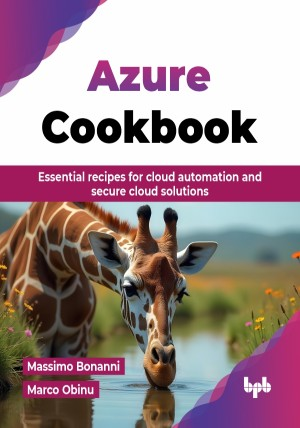

# Azure Cookbook

Essential recipes for cloud automation and secure cloud solutions.

This is the repository for [Azure Cookbook
](https://bpbonline.com/products/azure-cookbook-1?variant=44176432005320),published by BPB Publications.

## About the Book
"Azure Cookbook" is a practical guide designed to help developers, system administrators, and cloud architects master Microsoft Azure through hands-on solutions. This book offers step-by-step recipes for tackling real-world challenges using Azure’s vast range of services.

This book covers many important topics related to Azure, such as storage, networking, virtual machines, containers, and application development. It offers practical tips and step-by-step instructions for creating and managing secure Azure applications. You will learn about various Azure services, including Azure Storage, Virtual Networks, App Service, and Azure Security Center. Whether you are new to Azure or have some experience, this guide will help you gain the skills needed to use Azure effectively for your cloud computing projects.

With this book, you will not only enhance your Azure skills but also apply them directly to your job roles. By mastering the cloud, you will be equipped to design, deploy, and manage robust, scalable solutions-making you an invaluable asset in today’s cloud-driven world.

## What You Will Learn
• Deploying and managing Azure Virtual Machines, Networks, and Storage solutions.

• Automating cloud infrastructure using Bicep, ARM templates, and PowerShell.

• Implementing secure, scalable, and cost-effective cloud architectures.

• Building containerized apps with Azure Kubernetes Service (AKS).

• Creating serverless solutions using Azure Functions and Logic Apps.

• Troubleshooting Azure issues and optimizing performance for production workloads.
